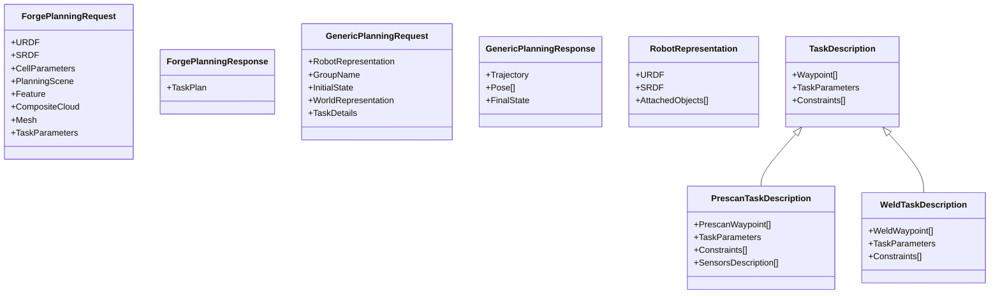

# Messages

```mermaid
classDiagram
    class ForgePlanningRequest {
        +URDF
        +SRDF
        +CellParameters
        +PlanningScene
        +Feature
        +CompositeCloud
        +Mesh
        +TaskParameters
    }

    class ForgePlanningResponse {
        +TaskPlan
    }

    class GenericPlanningRequest {
        +RobotRepresentation
        +GroupName
        +InitialState
        +WorldRepresentation
        +TaskDetails
    }

    class GenericPlanningResponse {
        +Trajectory
        +Pose[]
        +FinalState
    }

    class RobotRepresentation {
        +URDF
        +SRDF
        +AttachedObjects[]
    }

    class TaskDescription {
        +Waypoint[]
        +TaskParameters
        +Constraints[]
    }

    class PrescanTaskDescription {
        +PrescanWaypoint[]
        +TaskParameters
        +Constraints[]
        +SensorsDescription[]
    }
    
    class WeldTaskDescription {
        +WeldWaypoint[]
        +TaskParameters
        +Constraints[]
    }
    
    TaskDescription <|-- PrescanTaskDescription
    TaskDescription <|-- WeldTaskDescription
    
```