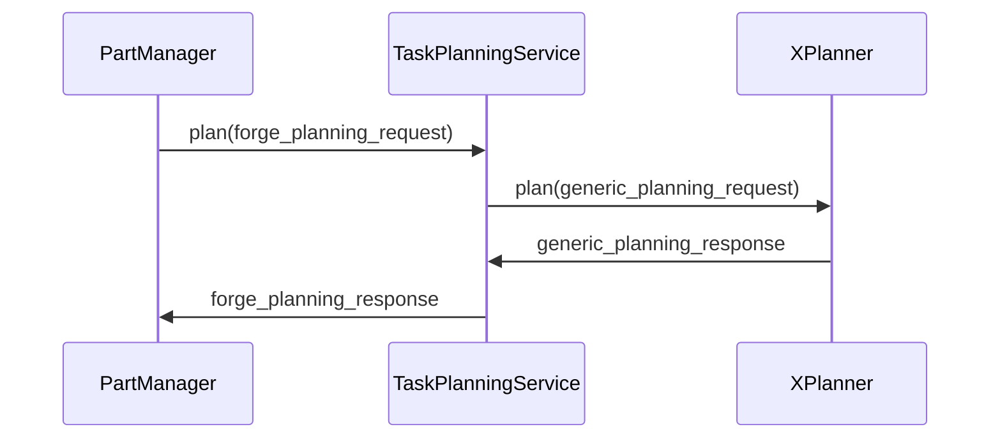
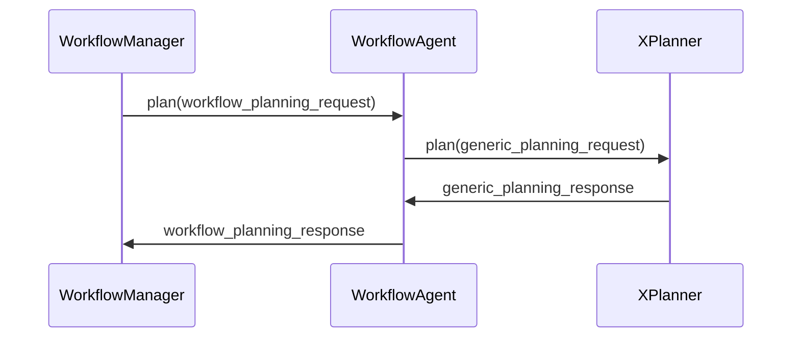
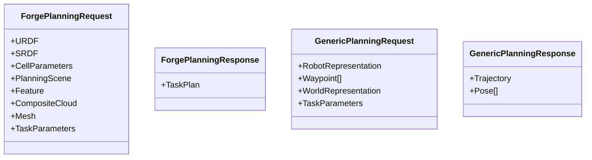

git # Overview

This is how PartManager would interact with the services we provide

This is how the WorkflowManager would interact with the services we provide

### Messages:

### Notes:
- XPlanner is a service we will provide.
- We will also be responsible for the WorkflowAgent and TaskPlanningService
- We will have control over whether we build a different Agent/Service for each planner type

