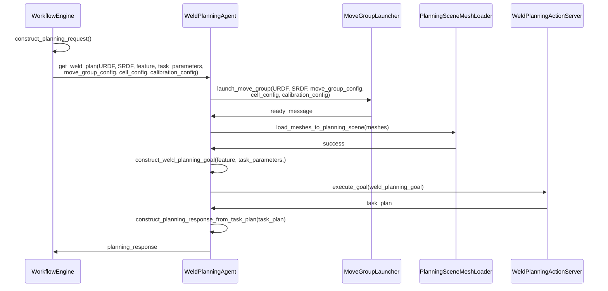

```mermaid

sequenceDiagram
    WorkflowEngine->>WorkflowEngine: construct_planning_request()
    WorkflowEngine->>WeldPlanningAgent: get_weld_plan(URDF, SRDF, feature, task_parameters,<br> move_group_config, cell_config, calibration_config)
    WeldPlanningAgent->>MoveGroupLauncher: launch_move_group(URDF, SRDF, move_group_config, <br> cell_config, calibration_config)
    MoveGroupLauncher->>WeldPlanningAgent: ready_message
    WeldPlanningAgent->>PlanningSceneMeshLoader: load_meshes_to_planning_scene(meshes)
    PlanningSceneMeshLoader->>WeldPlanningAgent: success
    WeldPlanningAgent->>WeldPlanningAgent: construct_weld_planning_goal(feature, task_parameters,)
    WeldPlanningAgent->>WeldPlanningActionServer: execute_goal(weld_planning_goal)
    WeldPlanningActionServer->>WeldPlanningAgent: task_plan
    WeldPlanningAgent->>WeldPlanningAgent: construct_planning_response_from_task_plan(task_plan)
    WeldPlanningAgent->>WorkflowEngine: planning_response
```
Notes:
- We can reuse some of the classes built for SIL
- We would still need to figure out the message sent between the WorkflowEngine and the WeldPlanningAgent