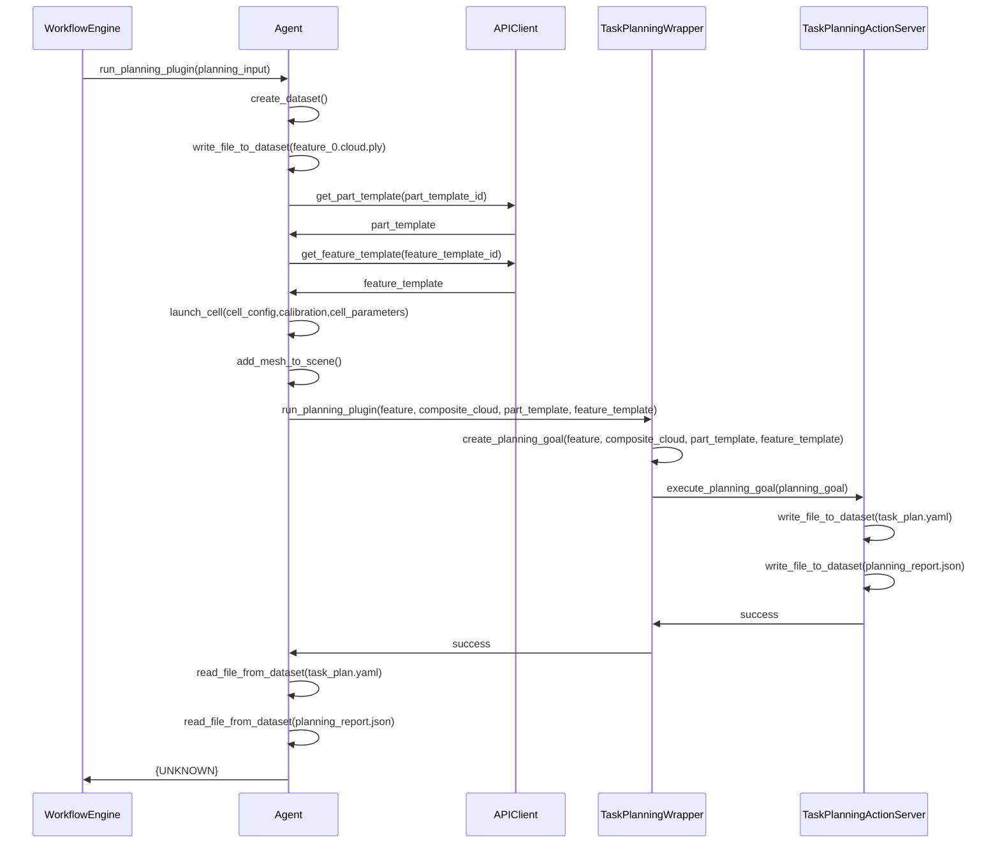

### Notes:
- Reliance on filesystem for Inter-Process Communication
- Each instance of Agent needs to communicate with the API
- Launching all of Forge and the entire cell just to get access to planning
